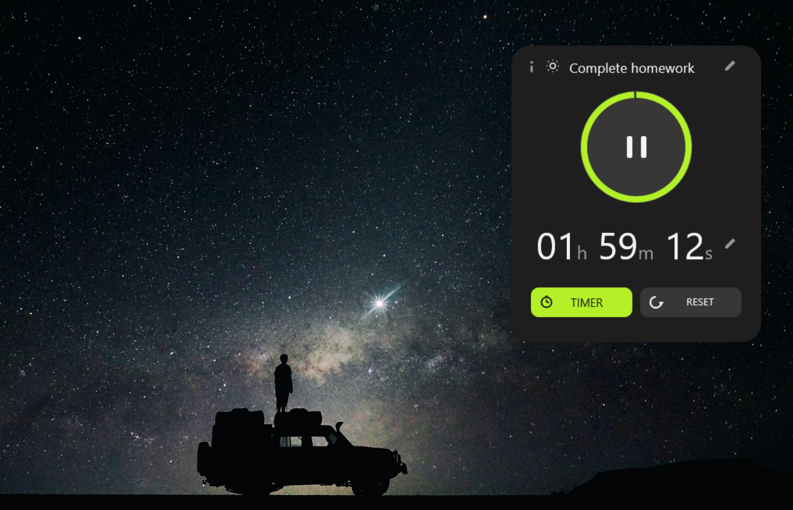
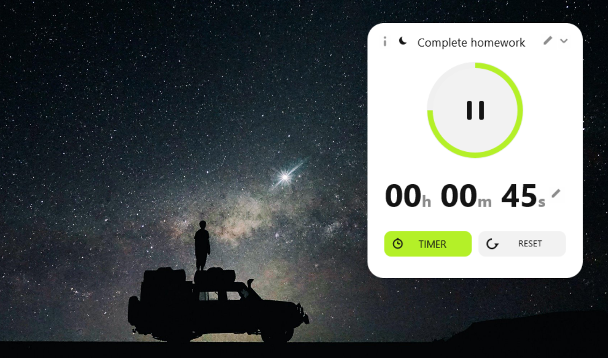
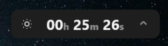
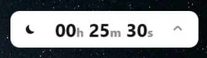
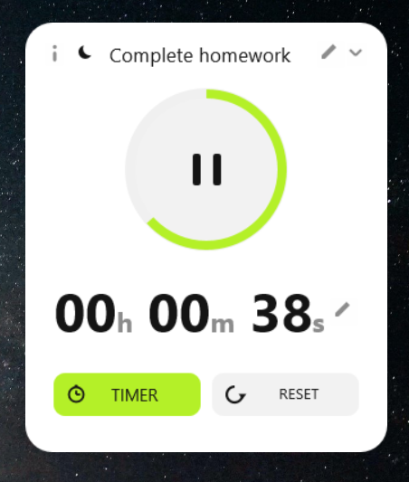
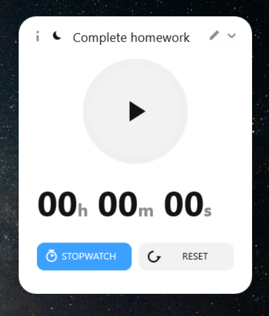
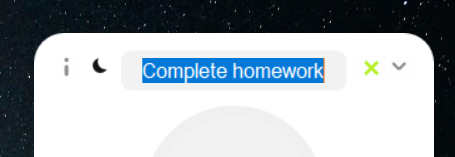

# Modern Timer Widget for Rainmeter

A sleek, minimal, and highly customizable Countdown Timer & Stopwatch desktop widget for **Rainmeter**, featuring modern typography, dynamic theme switching, compact mini mode, and interactive task management.

🌐 **Live Showcase Website**: [https://moderntimer.pages.dev/](https://moderntimer.pages.dev/)

Created with ❤️ by **[Prabhat Dutt](https://github.com/Prabhat-dutt)**.

---

## 📷 Previews

### 🎨 Dark & Light Themes
<div align="center">
  
  
</div>

<br />

### 🔹 Compact Mini Collapsed View
<div align="center">
  
  
</div>

<br />

### ⏱️ Timer & Stopwatch Modes
<div align="center">
  
  
</div>

<br />

### ✏️ Interactive Inline Editing
<div align="center">
  
</div>

<br />

### 📌 Info Overlay & Always-On-Top Setting
<div align="center">
  
  
</div>

---

## ✨ Features

- **⏱️ Dual Mode Support**: Switch seamlessly between **Countdown Timer** and **Stopwatch** modes.
- **🎨 Dark & Light Modes**: One-click theme toggle to complement any desktop aesthetic.
- **🔹 Compact Mini Mode**: One-click collapse to a sleek, low-profile status bar with centered digits and theme controls.
- **📌 Always On Top Toggle**: Built-in interactive toggle in the Info panel to float the widget above all open windows and browser tabs.
- **✏️ Interactive Editing**:
  - Click to edit the **Task Title**.
  - Click to customize **Timer Duration** (`HH:MM:SS`, `MM:SS`, or `SS` formats supported).
- **⭕ Circular Progress Ring**: Smooth visual timer ring showing real-time countdown progress.
- **ℹ️ Author Info Overlay**: Quick access info panel with version info, project links, and settings.
- **🅰️ Modern Typography**: Clean, high-readability fonts powered by `Bahnschrift` and `Segoe UI Variable`.

---

## 🛠️ Installation & Setup

1. Ensure **[Rainmeter](https://www.rainmeter.net/)** (v4.5 or newer) is installed on your Windows system.
2. Download or clone this repository:
   ```bash
   git clone https://github.com/Prabhat-dutt/ModernTimer.git
   ```
3. Copy the `ModernTimer` folder into your Rainmeter Skins directory:
   `C:\Users\<YourUsername>\Documents\Rainmeter\Skins\`
4. Open the Rainmeter Manager, expand **ModernTimer**, select `TimerWidget.ini`, and click **Load**.

---

## 🎮 How to Use

- **Play / Pause**: Click the center circle button.
- **Timer / Stopwatch Switch**: Click the mode icon in the bottom bar.
- **Collapse / Expand Mini View**: Click the chevron icon (`v` / `^`) at the top right.
- **Edit Duration**: Click the pencil icon next to the time display, enter your desired time, and press `Enter` to save.
- **Edit Title**: Click the pencil icon next to the title, type your task name, and press `Enter`.
- **Toggle Info View & Always-On-Top**: Click the `i` icon at the top left corner, then toggle the "Always On Top" checkbox.

---

## 🤝 Feedback & Contributions

Contributions, bug reports, and feature requests are very welcome! If you have suggestions or improvements:
- Open an [Issue](https://github.com/Prabhat-dutt/ModernTimer/issues) to report bugs or request features.
- Submit a [Pull Request](https://github.com/Prabhat-dutt/ModernTimer/pulls) to propose code enhancements.

---

## 📜 License & Usage Terms

© **Prabhat Dutt**. All rights reserved.

This repository and its source code are made publicly available for personal use, learning, and community feedback. 

- **Allowed**: Personal desktop customization, inspecting the code, opening issues/pull requests, and sharing feedback.
- **Restricted**: Copying, re-distributing, re-branding, hosting unauthorized mirrors, or using any part of this widget for commercial purposes without explicit permission.

If you enjoy this widget, consider leaving a ⭐ on GitHub!
